# Highland Fresh System - Project Blueprint & Pivot Plan

**Date:** December 7, 2025  
**Core Concept:** Manufacturing Plant (Not Online Store)  
**Key Principle:** FIFO (First-In, First-Out) Enforcement

---

## 🔴 EXECUTIVE SUMMARY

The system architecture has been pivoted to align with the actual business operations of a **Manufacturing Plant**.

| Aspect | Current System | Actual Business Need |
|--------|---------------|---------------------|
| Business Model | Online Store / E-commerce | Manufacturing Plant |
| Primary Input | Generic Purchase Orders | Daily Milk Receiving with Lab QC |
| Supplier Relationship | Standard Vendor | Farmer Cooperative (Payout System) |
| Sales Model | Customer Portal + Cart | Walk-in POS + Mall Charge Invoices |
| Key Tracking | Product Inventory | Raw Milk → Production → Bottles |

---

## PART 1: CORE MODULES

### Module A: Milk Receiving (QC Entry)
**Purpose:** Dairy-specific milk intake form with Lab QC.
**Key Features:**
- Fat % based pricing (High Quality = Higher Price)
- Transport deduction logic
- Rejection logic (Alcohol Test Fail = 0 Payment)
- Auto-updates `Raw Milk` inventory

### Module B: Farmer Payout
**Purpose:** Generate farmer payroll based on milk deliveries.
**Key Features:**
- Aggregated view per farmer
- Deducts rejected liters and transport fees
- Generates printable payslips

### Module C: Inventory Requisition & Procurement
**Purpose:** Low stock alerts + 2-Step Finance-Executed procurement workflow.
**Key Features:**
- Low stock dashboard widgets
- Warehouse Staff creates Purchase Requisition (PR)
- Finance Officer approves AND auto-generates PO (single action)
- Warehouse Staff receives goods and inputs final cost → triggers BOM recalculation

### Module D: Dual-Mode Sales/POS
**Purpose:** Handle both walk-in cash sales and mall charge invoices.
**Key Features:**
- **Walk-in (Cash):** Instant inventory deduction, Receipt printing.
- **Charge Invoice (Credit):** Payment terms (Net 30), AR tracking, Delivery Receipts.

---

## PART 2: USER ROLES

1. **Finance Officer**
   - Approve & Execute purchase requisitions (auto-generates PO)
   - Generate farmer payroll
   - Record mall payments (AR collection)
   - Budget control and cost monitoring

2. **QC Officer (Quality Control)**
   - Daily milk receiving entry
   - Lab results recording
   - Reject low-quality milk

3. **Warehouse Staff**
   - Create purchase requisitions (identify stock needs)
   - Receive goods and input actual invoice costs (triggers BOM)
   - Physical stock management
   - Dispatch validation (FIFO Enforcement)

4. **Production Supervisor**
   - Record production batches (FIFO Consumption)
   - Convert raw materials to finished goods using **locked Master Recipes**
   - Track production output and wastage
   - **Cannot modify recipes** - only select product and quantity

5. **Sales Officer**
   - Walk-in cash sales (POS)
   - Wholesale/Mall charge invoices
   - Print receipts/DR

6. **Admin**
   - System configuration and user management
   - Observer role for procurement (no daily intervention needed)
   - Full system access for troubleshooting

---

## PART 3: BUSINESS RULES & APPROVALS

### The Master Recipe Flow (Finance-Locked Formulas)
> **Design Principle:** Production cannot modify recipes. Finance defines exact ratios to ensure cost control and product consistency.

| Step | Actor | Action | System Behavior |
|------|-------|--------|-----------------|
| **1. Recipe Setup** | Finance Officer | Defines fixed ingredient ratios | Stores in `production_recipes` + `recipe_raw_materials` |
| **2. Production** | Production Supervisor | Selects product + quantity only | Auto-calculates materials from recipe × quantity |
| **3. BOM Trigger** | System | When prices change | Recalculates all product costs using locked ratios |

**Why This Matters:**
- Production cannot use extra ingredients "to make it taste better"
- Every gram is tracked against the formula
- Cost variance is immediately visible to Finance
- Same recipe = same product consistency always

### The 2-Step Finance-Executed Procurement Flow
> **Design Principle:** No Admin bottleneck. The person who controls the budget (Finance) is the same person who finalizes the order.

| Step | Actor | Action | System Result |
|------|-------|--------|---------------|
| 1 | Warehouse Staff | Creates Purchase Requisition | PR status = `Pending Approval` |
| 2 | Finance Officer | Clicks "Approve & Send" | PR = `Approved` + PO auto-generated & sent |
| 3 | Warehouse Staff | Receives goods, inputs cost | Inventory ↑, BOM recalculates |

### Why This Flow is Optimal
*   **No Bottlenecks:** Admin doesn't slow down production supplies.
*   **Financial Control:** Finance Officer has 100% control over company's outgoing cash.
*   **Automatic Traceability:** PR → PO → BOM linkage is fully automated.

### Who Approves What?
*   **Purchase Requisitions:** Approved & Executed by **Finance Officer** (Budget holder).
*   **Farmer Payouts:** Approved by **Finance Officer**.
*   **Sales Orders (Credit):** Auto-approved if within credit limit (future feature), currently manual check by Sales.

---

## PART 4: SYSTEM ARCHITECTURE

### Database Tables (Key)
*   `milk_daily_collections`: QC data
*   `farmer_payouts`: Financial records
*   `raw_material_batches`: FIFO tracking for inputs
*   `production_batches`: FIFO tracking for outputs
*   `raw_material_consumption`: Linkage between Input Batch → Output Batch

### API Structure
*   `MilkCollectionAPI.php`
*   `FarmerPayoutAPI.php`
*   `ProductionAPI.php` (FIFO Logic)
*   `SalesOrdersAPI.php` (FIFO Logic)
*   `RawMaterialsAPI.php`

---

## PART 5: BILL OF MATERIALS (BOM) ENGINE

> **Key Concept**: The system uses a **Dynamic Bill of Materials** to automatically recalculate production costs when any ingredient price changes. This ensures computation is automatic and accurate.

### What is the BOM?

Think of the BOM as the **"Master Recipe Card"** for every product. It stores the **fixed ratios** (exact amounts) of each ingredient needed to produce one unit of a finished product.

### Example: 1 Bottle of Choco Milk (500ml)

| Ingredient (Raw Material) | Fixed Amount Needed | Current Cost | Cost per Bottle |
|---------------------------|---------------------|--------------|-----------------|
| Raw Milk | 0.5 Liters | ₱20.00 / L | ₱10.00 |
| Sugar | 0.05 KG (50g) | ₱45.00 / KG | ₱2.25 |
| Cocoa Powder | 0.02 KG (20g) | ₱200.00 / KG | ₱4.00 |
| Empty Bottle (500ml) | 1 Piece | ₱5.00 / Pc | ₱5.00 |
| Bottle Cap | 1 Piece | ₱1.00 / Pc | ₱1.00 |
| **TOTAL PRODUCTION COST** | | | **₱22.25** |

---

### 🎯 Dual Trigger Points (Price Change Sources)

The BOM Engine has **TWO trigger points** based on where materials enter the system:

| Trigger | Who | Material Type | How Price Changes |
|---------|-----|---------------|-------------------|
| **Trigger A** | QC Officer | Raw Milk only | Sets `base_price_per_liter` when accepting milk collection |
| **Trigger B** | Warehouse Staff | All other materials (Sugar, Bottles, Caps, etc.) | Enters new `unit_cost` when receiving Purchase Order |


---

### 🥛 Scenario A: Raw Milk Price Changes (QC Officer)

When a cooperative delivers milk and the QC Officer sets a new price (₱20 → ₱25/L):

| Step | Actor | Action |
|------|-------|--------|
| 1 | QC Officer | Accepts milk collection, sets `base_price_per_liter = ₱25` |
| 2 | BOM Engine | Finds all products using Raw Milk (Fresh Milk, Choco Milk, Yogurt) |
| 3 | BOM Engine | Recalculates: Choco Milk cost increases from ₱10 to ₱12.50 (0.5L × ₱25) |
| 4 | Finance Officer | Receives alert: "Raw milk price increase affects 5 products" |

---

### 📦 Scenario B: Other Material Price Changes (Warehouse Staff)

When a new delivery of sugar arrives with an increased price (₱45.00 → ₱50.00 per kilo):

#### Step 1: The Trigger (Warehouse Staff)

| Who | Action | System Event |
|-----|--------|--------------|
| **Warehouse Staff** | Receives PO and enters: "Received 100kg Sugar @ ₱50.00/kg" | Updates `current_cost` of Sugar in database |

#### Step 2: The Automatic Recalculation (BOM Engine)

The system instantly:
1. **Finds** every product that uses Sugar in its recipe (Choco Milk, Yogurt, etc.)
2. **Re-runs** the BOM calculation using the fixed ratios

**The Math:**
```
OLD: 0.05 KG × ₱45.00 = ₱2.25
NEW: 0.05 KG × ₱50.00 = ₱2.50
```

**Result:** Total Production Cost of Choco Milk updates from **₱22.25 → ₱22.50**

#### Step 3: The Notification (Finance Officer)

| Action | Alert Message |
|--------|---------------|
| Finance Officer receives notification | "⚠️ Cost Alert: Sugar price increase has raised production cost of Choco Milk by ₱0.25 per bottle." |
| Decision | Review if selling price needs adjustment to maintain profit margin |

---

### Complete Workflow Diagram (Both Triggers)

```mermaid
sequenceDiagram
    participant QC as QC Officer
    participant WH as Warehouse Staff
    participant DB as Database
    participant BOM as BOM Engine
    participant FIN as Finance Officer

    Note over QC,WH: Two Entry Points for Price Changes
    
    alt Trigger A: Raw Milk
        QC->>DB: Accept milk @ ₱25/L (was ₱20)
        DB->>BOM: Trigger: Milk price changed
    else Trigger B: Other Materials
        WH->>DB: Receive PO: Sugar @ ₱50/kg (was ₱45)
        DB->>BOM: Trigger: Sugar price changed
    end
    
    BOM->>BOM: Find all affected products
    BOM->>BOM: Recalculate using fixed BOM ratios
    BOM->>DB: Update production_cost
    BOM->>FIN: Alert: "Cost changed for X products"
    FIN->>FIN: Review & decide on selling price
```



---

### Database Tables Supporting BOM

| Table | Purpose |
|-------|---------|
| `production_recipes` | Master recipe definitions linked to finished products |
| `recipe_raw_materials` | Fixed ratios: ingredient + quantity needed per unit |
| `raw_materials` | Current costs of all ingredients (updated on PO receive) |

---

### Summary for Professor

> *"Sir, our system uses a **Dynamic Bill of Materials**. It doesn't matter if the price of milk, sugar, or even the bottle caps changes. Because we have programmed the **Fixed Ratios** (the exact recipe amounts) into the database, the system **automatically recalculates** the total cost of the finished product whenever any ingredient's incoming price changes. This ensures the computation is **automatic and accurate**, exactly as you requested."*

---

*Document Consolidated: December 7, 2025*
*Updated: January 1, 2026 - Added BOM Engine with detailed example*

